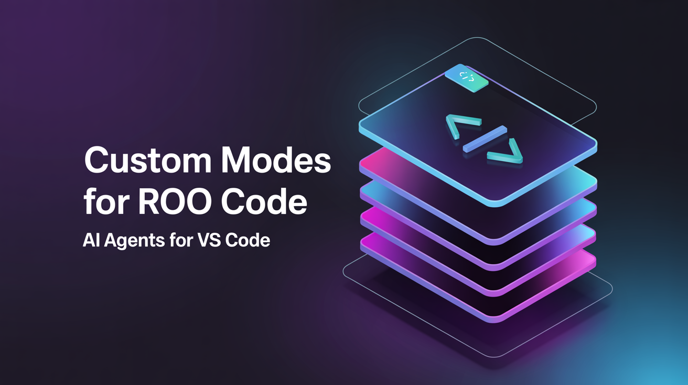

<div align="center">



</div>

# Custom Modes for Roo Code 🤖

<div align="center">

[](https://opensource.org/licenses/MIT)
[](https://github.com/jtgsystems/Custom-Modes-Roo-Code)
[](https://github.com/jtgsystems/Custom-Modes-Roo-Code)
[](https://github.com/jtgsystems/Custom-Modes-Roo-Code)
[](https://github.com/jtgsystems/Custom-Modes-Roo-Code)

### ⭐ **[Star this repo](https://github.com/jtgsystems/Custom-Modes-Roo-Code/stargazers)** if you find it useful! ⭐

</div>

> **Professional AI Agent Configuration Library for Roo Code - 2025 Edition**
>
> A comprehensive collection of 171 specialized AI agents designed for modern software development, following 2025 security-first principles and best practices.

## 🚀 Quick Start

```bash
# Clone the repository
git clone https://github.com/jtgsystems/Custom-Modes-Roo-Code.git

# Navigate to agent categories
cd Custom-Modes-Roo-Code/agents

# Select your agent configuration
cp core-development/general/python-developer.yaml ~/.roo-code/agents/
```

## 📚 Table of Contents

- [Overview](#overview)
- [Agent Categories](#agent-categories)
- [Installation](#installation)
- [Usage](#usage)
- [Agent Structure](#agent-structure)
- [Contributing](#contributing)
- [Security](#security)
- [License](#license)

## 🎯 Overview

This repository contains a meticulously curated collection of AI agent configurations for Roo Code, designed to accelerate development workflows across multiple domains. Each agent is optimized for 2025 development standards with emphasis on:

- **Security-First Architecture** 🔒
- **Performance Optimization** ⚡
- **Modern Framework Support** 🏗️
- **Industry Best Practices** ✨
- **Comprehensive Domain Coverage** 🌐

### Key Features

- ✅ **171 Specialized Agents** across 9 categories
- ✅ **YAML-based Configuration** for easy customization
- ✅ **2025 Security Standards** compliance
- ✅ **Production-Ready Templates**
- ✅ **Cross-Platform Compatibility**
- ✅ **Modular Architecture**

## 🗂️ Agent Categories

### 🧠 AI & Machine Learning (11 agents)
**Specialized AI/ML development and deployment**
- Machine Learning Engineers
- AI System Architects
- Data Science Specialists
- MLOps Engineers
- Computer Vision Experts
- NLP Specialists
- LLM Integration Specialists

### 💼 Business & Product (15 agents)
**Business strategy and product development**
- Product Managers
- Business Analysts
- Marketing Specialists
- Sales Engineers
- Content Strategists

### 💻 Core Development (36 agents)
**Foundation development roles and architectures**
- Full-Stack Developers
- Backend Specialists
- Frontend Experts
- System Architects
- API Designers
- Integration Specialists

### 🏗️ Infrastructure & DevOps (14 agents)
**Modern infrastructure and deployment**
- Cloud Engineers (AWS, Azure, GCP)
- Kubernetes Specialists
- Docker Experts
- Monitoring & Observability
- Network Engineers

### 💬 Language Specialists (23 agents)
**Programming language experts**
- **Python** - FastAPI, Django, asyncio
- **JavaScript/TypeScript** - React, Node.js, Next.js
- **Rust** - Systems programming, WebAssembly
- **Go** - Microservices, concurrent systems
- **Java** - Spring Boot, enterprise systems
- **C#** - .NET, Azure integration

### ⚖️ Legal & Compliance (14 agents)
**Regulatory and legal expertise**
- GDPR Compliance
- Security Auditing
- Legal Documentation
- Regulatory Analysis

### 🎛️ Meta-Orchestration (28 agents)
**System coordination and workflow management**
- Workflow Orchestrators
- Project Coordinators
- System Monitors
- Process Optimizers
- Integration Managers

### 🔐 Security & Quality (13 agents)
**Security-first development and quality assurance**
- Cybersecurity Experts
- Penetration Testers
- Security Auditors
- Accessibility Specialists
- Compliance Officers

### 🎯 Specialized Domains (17 agents)
**Industry-specific expertise**
- **Fintech** - Financial systems, compliance
- **Gaming** - Game development, engines
- **Blockchain** - Smart contracts, DeFi
- **IoT** - Edge computing, sensors
- **SEO** - Search optimization, analytics

## 📦 Installation

### Prerequisites

- **Roo Code** CLI tool installed
- **Git** for repository management
- **Node.js 18+** (recommended)
- **Python 3.9+** (for AI/ML agents)

### Method 1: Full Installation

```bash
# Clone the complete repository
git clone https://github.com/jtgsystems/Custom-Modes-Roo-Code.git
cd Custom-Modes-Roo-Code

# Install to Roo Code directory
cp -r agents ~/.roo-code/custom-modes/
```

### Method 2: Selective Installation

```bash
# Install specific category
cp -r agents/core-development ~/.roo-code/agents/

# Install specific agent
cp agents/language-specialists/python/python-developer.yaml ~/.roo-code/agents/
```

### Method 3: Direct Configuration

```bash
# Use curl for individual agents
curl -O https://raw.githubusercontent.com/jtgsystems/Custom-Modes-Roo-Code/main/agents/core-development/general/python-developer.yaml
```

## 🛠️ Usage

### Basic Usage

1. **Select an Agent**
   ```bash
   ls agents/core-development/general/
   ```

2. **Configure Roo Code**
   ```bash
   roo-code config set agent-path agents/python-developer.yaml
   ```

3. **Activate Agent**
   ```bash
   roo-code activate python-developer
   ```

### Advanced Configuration

```yaml
# Example customization in your project
agent_config:
  base: "python-developer"
  customizations:
    frameworks: ["FastAPI", "Pydantic", "SQLAlchemy"]
    deployment: "docker"
    testing: "pytest"
    ci_cd: "github-actions"
```

### Integration Examples

#### Python Development
```bash
# Set up Python FastAPI project
roo-code new-project --agent python-developer --template fastapi
```

#### React Development
```bash
# Set up React TypeScript project
roo-code new-project --agent typescript-developer --template react-ts
```

#### Full-Stack Project
```bash
# Combine multiple agents
roo-code orchestrate --agents "python-developer,typescript-developer,postgres-pro"
```

## 📋 Agent Structure

Each agent follows a standardized YAML structure:

```yaml
name: "Agent Name"
version: "2025.1"
category: "core-development"
description: "Agent description"
role: |
  Detailed role and capabilities description
capabilities:
  - capability1
  - capability2
frameworks:
  - framework1
  - framework2
security_features:
  - security_feature1
  - security_feature2
best_practices:
  - practice1
  - practice2
```

### Agent Metadata

- **Name**: Human-readable agent identifier
- **Version**: 2025.1 standard compliance
- **Category**: Primary domain classification
- **Role**: Detailed capability description
- **Frameworks**: Supported technologies
- **Security**: 2025 security standards

## 🔐 Security

### Security Standards Compliance

All agents adhere to **2025 Security Standards**:

- ✅ **Zero-Trust Architecture**
- ✅ **Secure by Default Configuration**
- ✅ **OWASP Top 10 Compliance**
- ✅ **Supply Chain Security**
- ✅ **Container Security**
- ✅ **API Security Best Practices**

### Security Features

```yaml
security_features:
  - input_validation
  - output_sanitization
  - secure_coding_practices
  - vulnerability_scanning
  - dependency_checking
  - secrets_management
```

### Reporting Security Issues

Please report security vulnerabilities to: **security@jtgsystems.com**

## 🤝 Contributing

### Development Workflow

1. **Fork the Repository**
   ```bash
   git fork https://github.com/jtgsystems/Custom-Modes-Roo-Code.git
   ```

2. **Create Feature Branch**
   ```bash
   git checkout -b feature/new-agent
   ```

3. **Add Your Agent**
   ```bash
   # Follow the template structure
   cp template.yaml agents/category/subcategory/your-agent.yaml
   ```

4. **Test Configuration**
   ```bash
   roo-code validate agents/category/subcategory/your-agent.yaml
   ```

5. **Submit Pull Request**

### Agent Submission Guidelines

- Follow YAML structure standards
- Include comprehensive role description
- Specify security features
- Add relevant frameworks and capabilities
- Test with Roo Code CLI

### Quality Standards

- **Security First**: All agents must pass security validation
- **Performance**: Optimized for fast initialization
- **Documentation**: Clear, comprehensive descriptions
- **Testing**: Validated with real-world scenarios

## 📊 Statistics

| Category | Agents | Primary Use Case |
|----------|--------|------------------|
| 🧠 AI & ML | 11 | Machine learning and AI development |
| 💼 Business & Product | 15 | Product strategy and business analysis |
| 💻 Core Development | 36 | Application development and architecture |
| 🏗️ Infrastructure & DevOps | 14 | Cloud infrastructure and deployment |
| 💬 Language Specialists | 23 | Programming language expertise |
| ⚖️ Legal & Compliance | 14 | Regulatory and legal compliance |
| 🎛️ Meta-Orchestration | 28 | Workflow and system coordination |
| 🔐 Security & Quality | 13 | Security and quality assurance |
| 🎯 Specialized Domains | 17 | Industry-specific applications |

**Total: 171 Specialized Agents**

## 🔗 Related Resources

- **Roo Cline Extension** - [VS Code Marketplace](https://marketplace.visualstudio.com/items?itemName=RooCline.roo-cline) - AI coding assistant
- **GitHub Repository** - [This Project](https://github.com/jtgsystems/Custom-Modes-Roo-Code) - Agent configurations
- **VS Code** - [Official Site](https://code.visualstudio.com/) - Development environment

## 📞 Support

- **Issues**: [GitHub Issues](https://github.com/jtgsystems/Custom-Modes-Roo-Code/issues) - Report bugs or request features
- **Discussions**: [GitHub Discussions](https://github.com/jtgsystems/Custom-Modes-Roo-Code/discussions) - Ask questions and share ideas
- **Contact**: [JTG Systems](https://jtgsystems.com) - Professional support
- **Email**: support@jtgsystems.com

## 📄 License

This project is licensed under the **MIT License** - see the [LICENSE](LICENSE) file for details.

```
MIT License

Copyright (c) 2025 JTG Systems

Permission is hereby granted, free of charge, to any person obtaining a copy
of this software and associated documentation files (the "Software"), to deal
in the Software without restriction, including without limitation the rights
to use, copy, modify, merge, publish, distribute, sublicense, and/or sell
copies of the Software, and to permit persons to whom the Software is
furnished to do so, subject to the following conditions:

The above copyright notice and this permission notice shall be included in all
copies or substantial portions of the Software.
```

## 🙏 Acknowledgments

- **Roo Code Team** - For the amazing development platform
- **Open Source Community** - For continuous inspiration
- **Contributors** - For making this project possible
- **Security Researchers** - For ensuring robust security standards

---

<div align="center">

**Built with ❤️ by [JTG Systems](https://github.com/jtgsystems)**

**Following 2025 Security-First Development Standards**

[](https://github.com/jtgsystems)
[](https://jtgsystems.com)

</div>

### SEO Keyword Cloud

`openai` `codex` `claude` `roo` `code` `ai` `agent` `configurations` `yaml` `security` `devops` `automation` `workflow` `orchestration` `mlops` `machine` `learning` `fintech` `gaming` `compliance` `developer` `productivity` `vscode` `extension` `templates` `toolkit` `multiagent` `architecture` `integration` `pipelines` `testing` `monitoring` `observability` `cloud` `kubernetes` `docker` `python` `javascript` `typescript` `rust` `golang` `java` `csharp` `gdpr` `governance` `practices` `ultrathink` `optimization` `roadmap` `supporters`
